# Research Summary: SciCat `metadataTypes` API Endpoint Performance with Caching

## Overview

This research investigates the performance of a SciCat `metadataTypes` API  endpoint backed by MongoDB under various load scenarios. The study evaluates the impact of caching and scaling factors, such as the number of records queried and the request rate (RPS). Key performance metrics include latency percentiles and request throughput. The findings highlight bottlenecks and the effectiveness of caching in enhancing system performance.

## Motivation

Efficient system design and capacity planning are crucial for ensuring a seamless user experience, especially for applications expected to handle high loads. This study aims to:

* Establish baseline performance for a Node.js API server under varying loads.
* Assess the role of caching in reducing latency and improving throughput.
* Identify bottlenecks when querying large datasets.

## Methodology

Environment:

* Application: nginx + 4 SciCat backend instances.
* Database: one instance of MongoDB, filled with generated data.
* Testing Tool: wrk, a modern HTTP benchmarking tool.
* VM:

  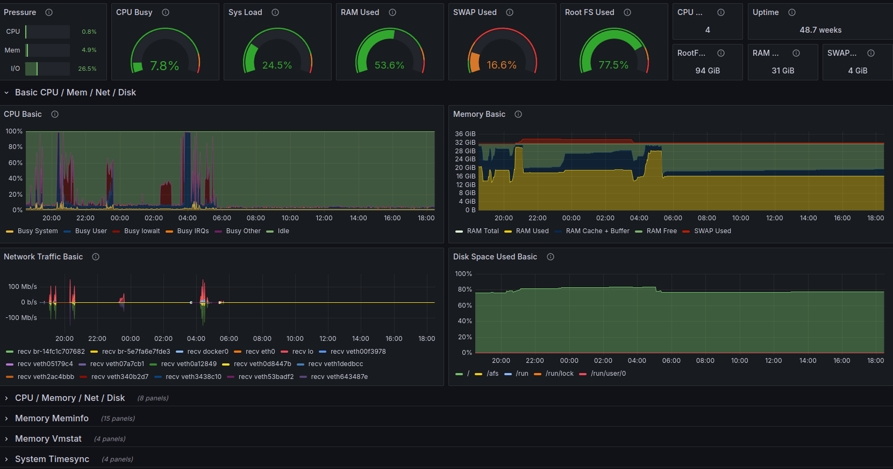

Scenarios:

Tested against datasets with 1,000, 10,000, 100,000, and 250,000 records.

Number of metadata fields: 100 and 1000.

Requests Per Second (RPS): 100, 500, 1,000.

Connections: Fixed at 10 (-c 10).

Caching:

Results were compared between cache-disabled and cache-enabled scenarios.

Pre-computation of cache for larger datasets was analyzed for its time cost and effectiveness.

Metrics:

Latency (50th, 75th, 90th, and 99th percentiles).

Request throughput (RPS).

Failed requests (timeouts, errors).

## Findings

Without Cache:

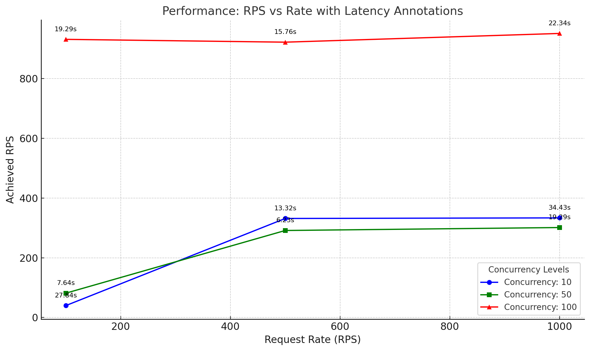

High latency and increased failures for large datasets (e.g., 10,000+ records).

Performance degraded significantly as RPS increased, especially for datasets over 100,000 records.

Basically the application is not usefull.

With Cache:

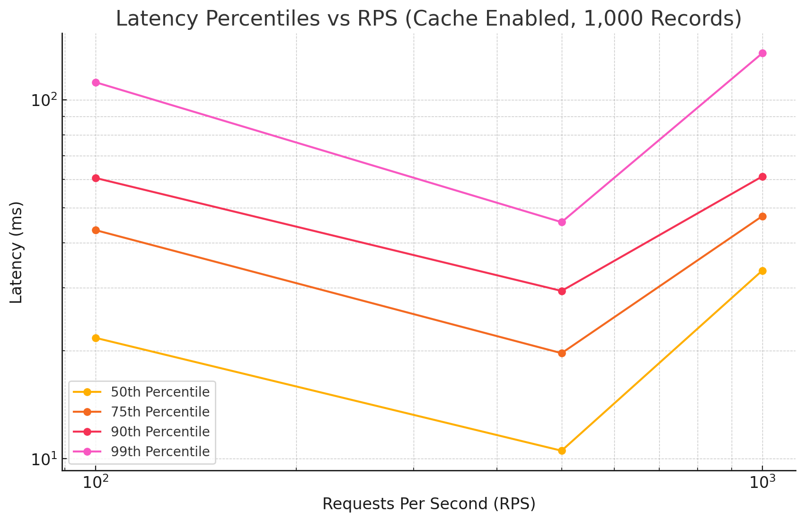

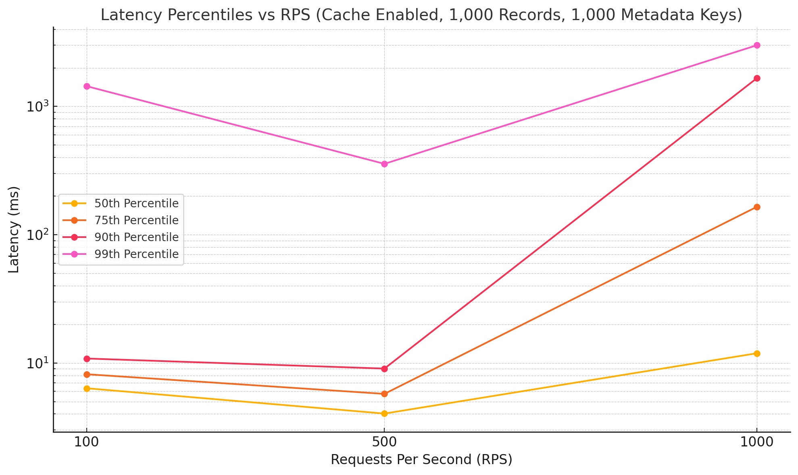

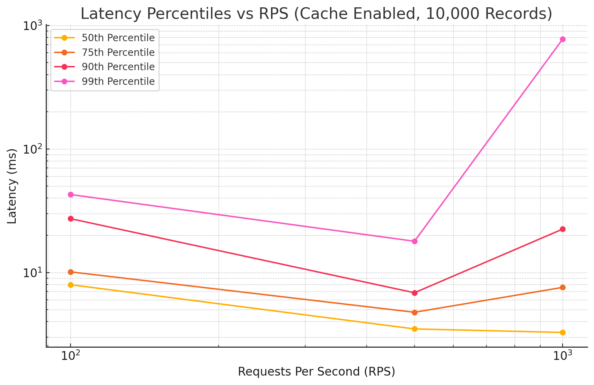

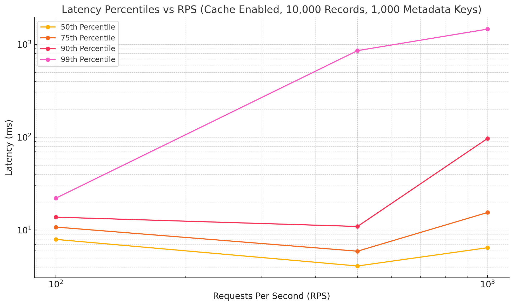

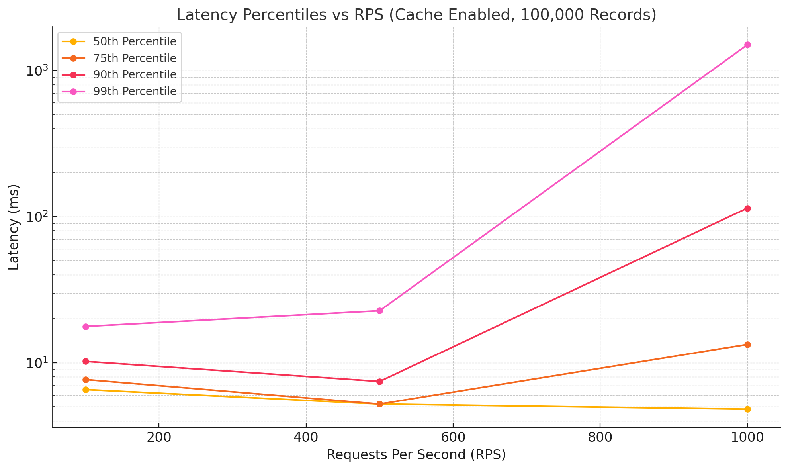

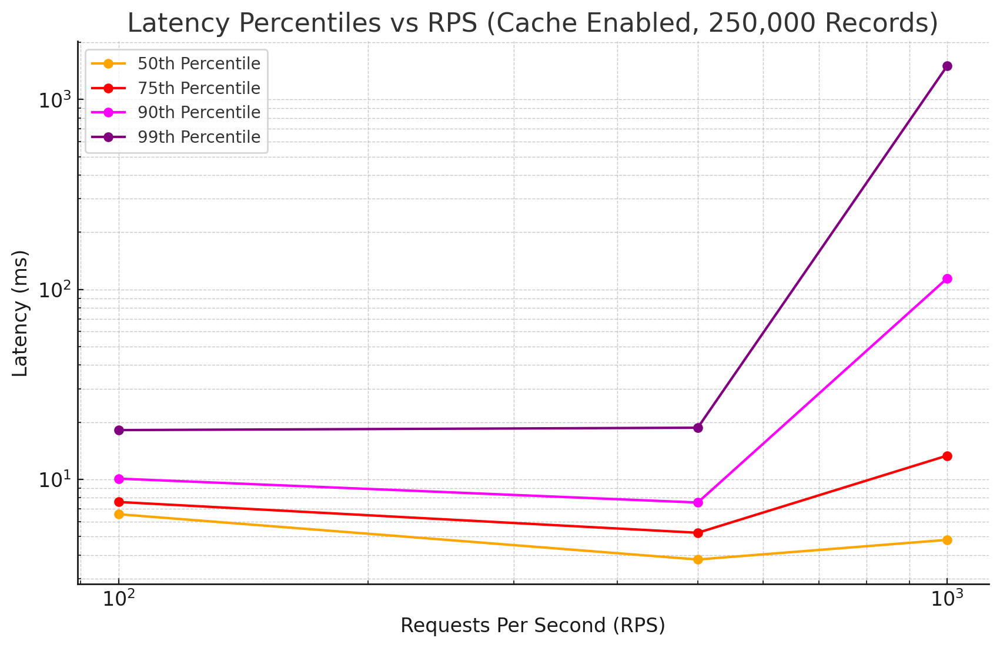

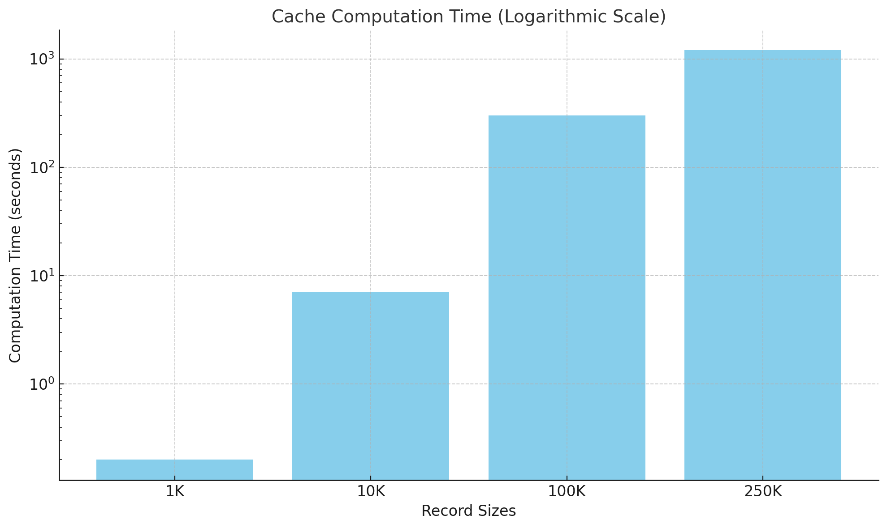

Dramatic reduction in latency for all dataset sizes.

Near-linear scaling for RPS up to 500 for datasets of 1,000 and 10,000 records.

Larger datasets (100,000+ records) showed improved performance but required significant time to precompute the cache i.e. 5+ min.

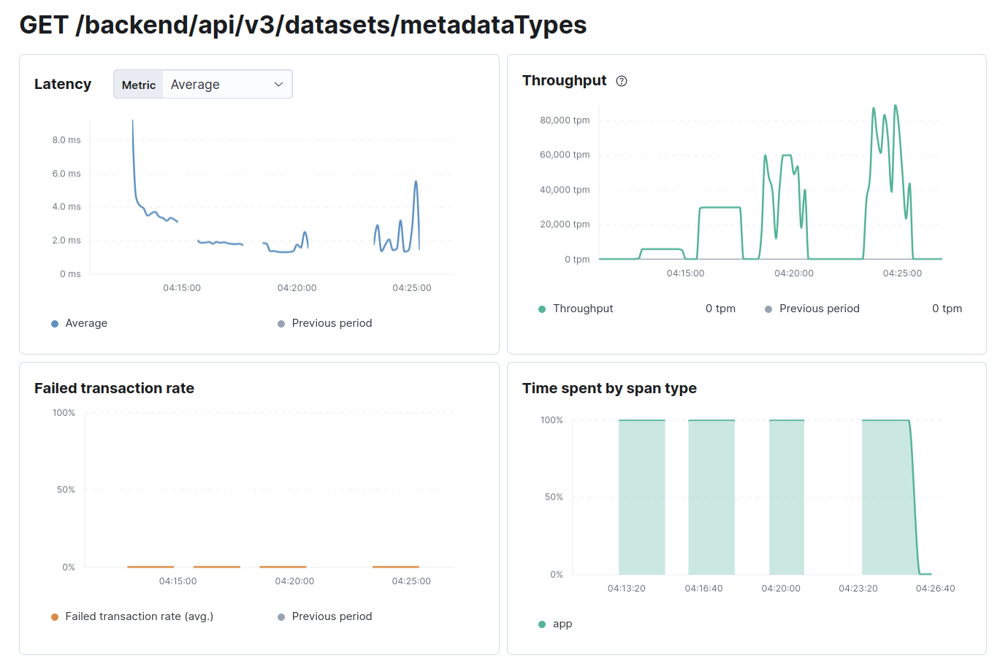

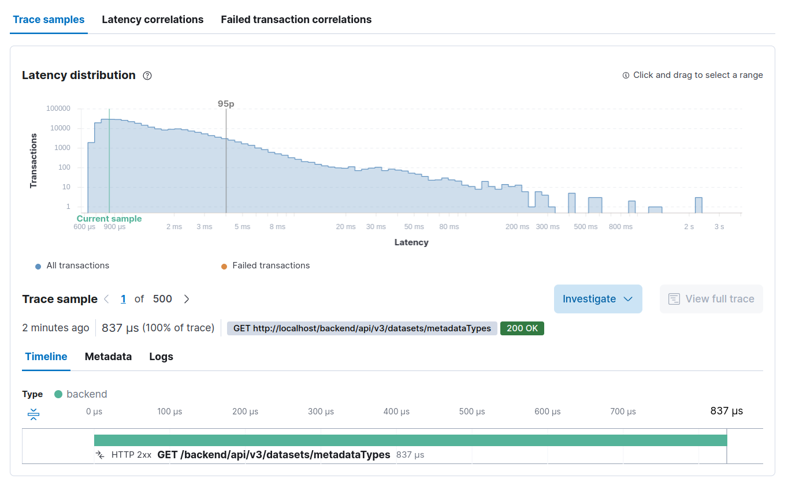

These screenshots ARE from Elastic APM that provide insights into the performance of the `GET /backend/api/v3/datasets/metadataTypes` endpoint during test runs. 

Here's a breakdown of the metrics displayed:

Latency:

The average response time of the endpoint over the test duration is shown in milliseconds. The graph indicates that latency starts high and stabilizes at a much lower value, with occasional spikes, possibly reflecting the test load or system adjustments during the run.

Throughput:

The throughput, measured in transactions per minute (tpm), demonstrates the request-handling capacity of the endpoint. The graph shows periods of varying activity, including ramp-up phases and peak transaction processing times.

Failed Transaction Rate:

This metric tracks the percentage of failed requests. In this test, the failed transaction rate remains near 0%, indicating a high success rate during the tests, which reflects good system reliability under the given conditions.

Time Spent by Span Type:

This section displays the distribution of time spent by the application in processing the requests. The chart shows that 100% of the time is allocated to the application logic, highlighting that most delays are intrinsic to the application and not caused by external dependencies.

## Key Observations:

For smaller datasets (1,000 and 10,000 records), latency remained low across all percentiles even at high RPS.

Larger datasets (100,000 and 250,000 records) exhibited latency spikes at high RPS, particularly in the 90th and 99th percentiles.

Caching effectively masked database query latency but was limited by the precomputation overhead for very large datasets.

## Visualizations

To aid analysis, latency percentiles (50th, 75th, 90th, and 99th) were plotted against RPS for each dataset size, highlighting:

The impact of increasing RPS on latency.

The role of caching in reducing high-latency tail events.

## Conclusion

This research underscores the importance of caching for read-heavy workloads, especially when dealing with large datasets. While caching significantly improves performance, the time cost of precomputing the cache for large datasets must be accounted for in deployment strategies. 

## Repository

This research is part of the Performance Benchmarking for Node.js Applications project. Contributions and feedback are welcome!

## References

[Building a Reliable Node.js Application | Part I](https://blog.platformatic.dev/building-a-reliable-nodejs-application-part-1)

[Building a reliable Node.js application | Part II](https://blog.platformatic.dev/building-a-reliable-nodejs-application-part-ii)
